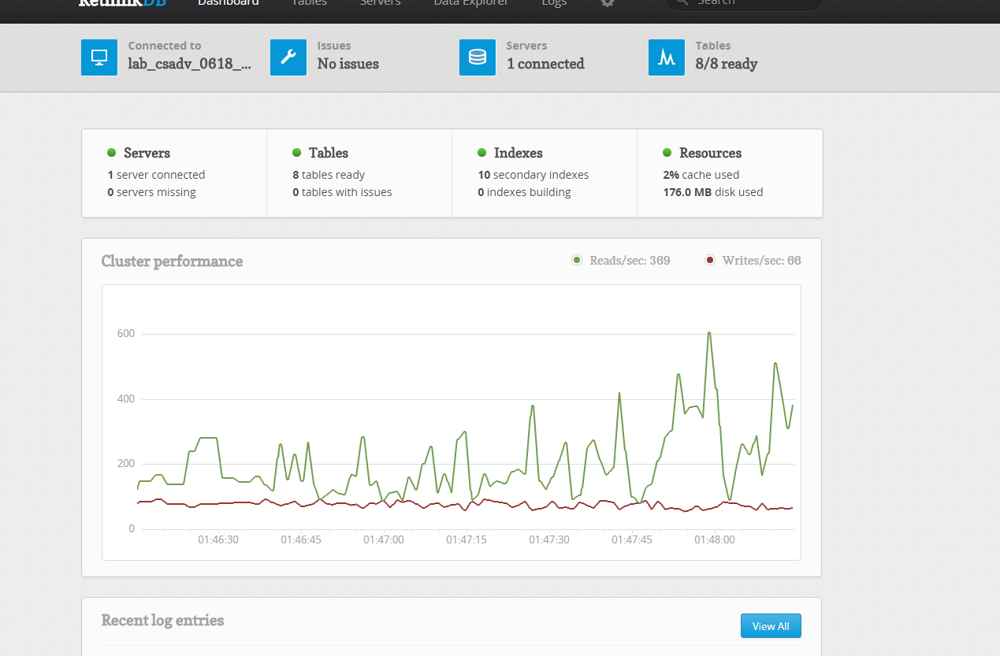

Hello World (Crawl an Area)
===============================

Let's let's crawl the traffic flow data of your favorite city.

Copy the following code and store it in ``hello_city.py``:: 

    # hello_city.py

    from streettraffic.server import TrafficServer
    from streettraffic.predefined.cities import San_Francisco_polygon

    settings = {
        'app_id': 'F8aPRXcW3MmyUvQ8Z3J9',  # this is where you put your App ID from here.com
        'app_code' : 'IVp1_zoGHdLdz0GvD_Eqsw', # this is where you put your App Code from here.com
        'map_tile_base_url': 'https://1.traffic.maps.cit.api.here.com/maptile/2.1/traffictile/newest/normal.day/',
        'json_tile_base_url': 'https://traffic.cit.api.here.com/traffic/6.2/flow.json?'
    }

    ## initialize traffic server
    server = TrafficServer(settings)
    server.start()

Then run the folloing command in a console at the current directory::

    python hello_city.py

Now open `<http://localhost:8080>`_ for our RethinkDB Web UI 
and open `<http://localhost:9000>`_ for our Web UI. Hit the
**Enter** button on the main page. Now go to ``Quick Start -- Register an area``
link on the left menu, you should be seeing this:

Now hit the **1. LOAD DRAWING TOOLS** button, then hit the little polygon
tool inside of the map, and start drawing. When you are finished, hit 
**2. FINISHED DRAWING POLYGON** button. Now you should be seeing this:

Give the area a name under **Area Description** and hit **REGISTER THIS CITY** button.

If you want to register more than one city, you need to refresh the page and
start drawing again.

When you are done, click the ``Quick Start -- Run the crawler`` link on the left Menu. Then 
click **RUN THE CRAWLER** button. Now if you see the console, you should see this:

You may also open `<http://localhost:8080>`_ to see reads and writes that are going on 
in your database. It looks like this:

When the reads and writes are finished, you may open `<http://localhost:9000>`_ and 
open the ``Query -- Traffic Flow Query`` link on the left Menu and follow the step to query 
a route within the area you just registered.

That's it!