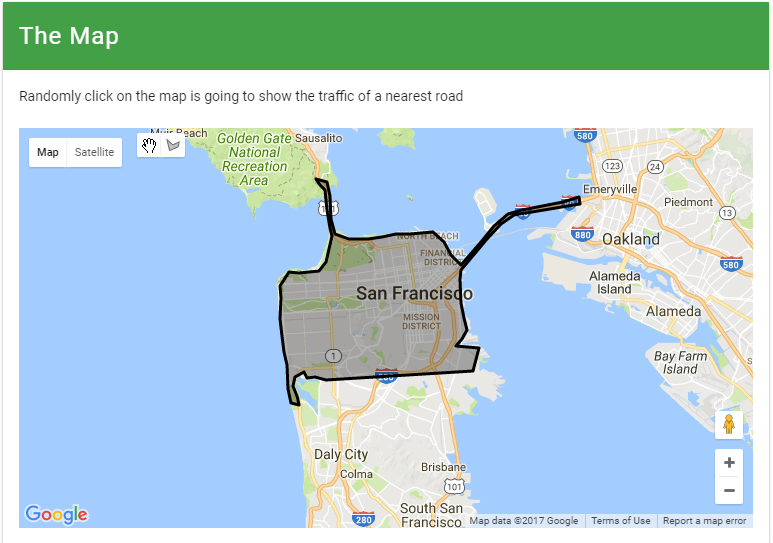

Hello World (Crawl a City)
===============================

Let's crawl the traffic flow data of San Francisco! We predefined a 
``San_Francisco_polygon`` for you. The polygon looks like this:

Copy the following code and store it in ``traffic.py``:: 

    # traffic.py

    ## import system module
    import json
    import rethinkdb as r
    import time
    import datetime as dt
    import asyncio

    ## import custom module
    from streettraffic.server import TrafficServer
    from streettraffic.predefined.cities import San_Francisco_polygon

    settings = {
        'app_id': 'F8aPRXcW3MmyUvQ8Z3J9',  # this is where you put your App ID from here.com
        'app_code' : 'IVp1_zoGHdLdz0GvD_Eqsw', # this is where you put your App Code from here.com
        'map_tile_base_url': 'https://1.traffic.maps.cit.api.here.com/maptile/2.1/traffictile/newest/normal.day/',
        'json_tile_base_url': 'https://traffic.cit.api.here.com/traffic/6.2/flow.json?'
    }

    ## initialize traffic server
    server = TrafficServer(settings)
    San_Francisco_matrix = server.util.get_area_tile_matrix_url("traffic_json", San_Francisco_polygon, 14, True)
    server.traffic_matrix_list = [San_Francisco_matrix]

    server.start()
    conn = server.traffic_data.conn

Then run ::

    python traffic.py

Now open `<http://localhost:8080>`_ for our RethinkDB Web UI. And it should be crawling data like
the following picture. When it's done, open `<http://localhost:9000>`_ for our Web UI.