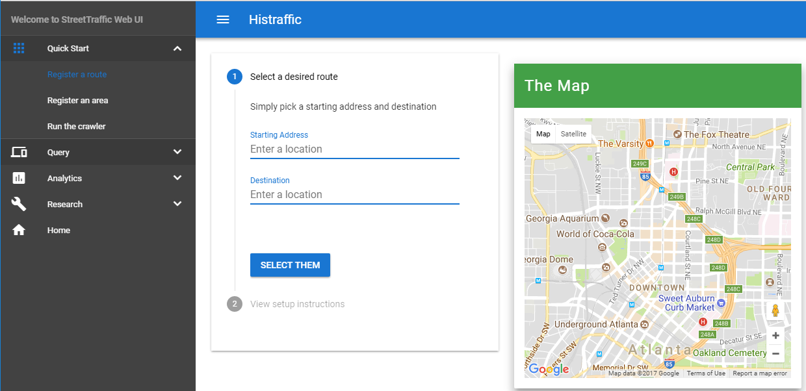
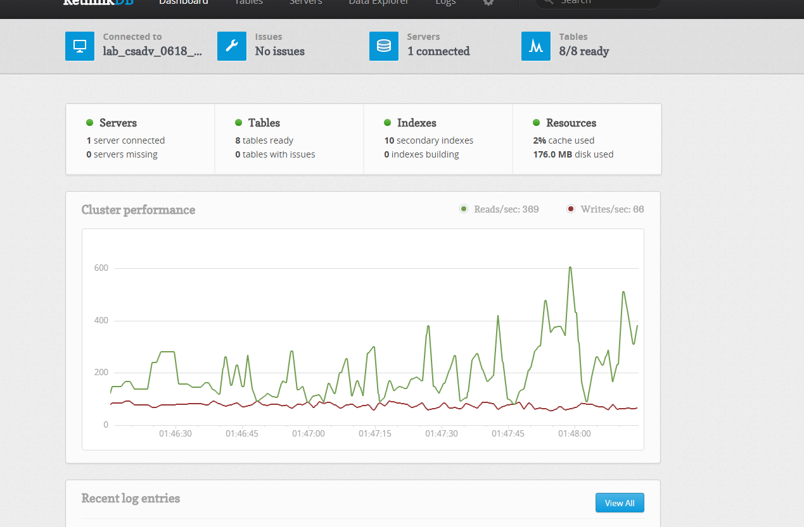

Hello World (Crawl a Route)
===============================

Let's let's crawl the traffic flow data of your favorite route.

Copy the following code and store it in ``hello_route.py``:: 

    # hello_route.py

    from streettraffic.server import TrafficServer
    from streettraffic.predefined.cities import San_Francisco_polygon

    settings = {
        'app_id': 'F8aPRXcW3MmyUvQ8Z3J9',  # this is where you put your App ID from here.com
        'app_code' : 'IVp1_zoGHdLdz0GvD_Eqsw', # this is where you put your App Code from here.com
        'map_tile_base_url': 'https://1.traffic.maps.cit.api.here.com/maptile/2.1/traffictile/newest/normal.day/',
        'json_tile_base_url': 'https://traffic.cit.api.here.com/traffic/6.2/flow.json?'
    }

    ## initialize traffic server
    server = TrafficServer(settings)
    server.start()

Then run the folloing command in a console at the current directory::

    python hello_route.py

Now open `<http://localhost:8080>`_ for our RethinkDB Web UI 
and open `<http://localhost:9000>`_ for our Web UI. Hit the
**Enter** button on the main page. Now you should see the ``Register a route``
page opened like this:

Enter the starting address and destination address. When you are finished, click
the **SELECT THEM** button, it will automatically generate a ``route_collection.json``
in the folder of which you stored ``hello_route.py``. You may hit button **haha** 
multiple times to select multiple interested route.

When you are done, click the **Run the crawler** link on the left Menu. Then 
click **RUN THE CRAWLER** button. Now if you see the console, you should see .
You may also open `<http://localhost:8080>`_ to see reads and writes that are going on 
in your database. It looks like this:

When the reads and writes are finished, you may open `<http://localhost:9000>`_ and 
open the **Traffic Flow Query** link on the left Menu and follow the step to query 
the same route you registered earlier. 