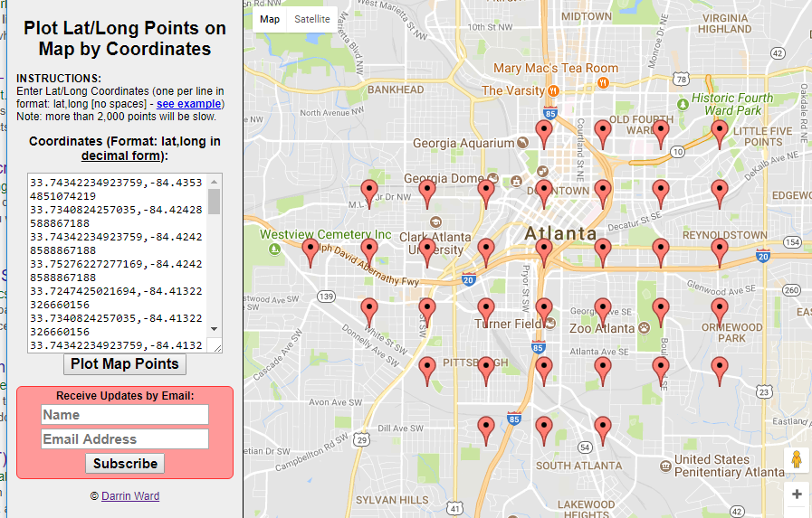
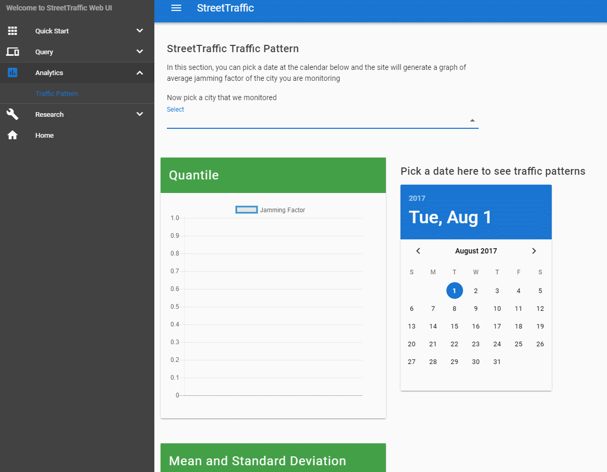

Setup Traffic Pattern Analytics
==================================

You might be interested in the traffic pattern 
of a given area. StreetTraffic allows you to sample
points/roads within a geospatial region and calculate the
average Jamming Factor of those roads. 

.. note::
    Jamming Factor is a measurement of traffic flow on a scale
    from 0 to 10. 10 means the road is stopped or closed, 9 means road has
    slow traffic, and 0 means free flow.

Spatial Sampling
-------------------------------

Before we start, you can find the source code of this tutorial 
at `here <https://raw.githubusercontent.com/streettraffic/streettraffic/develop/examples/hello_sample.py>`_

Given a polygon, you may use :py:meth:`streettraffic.database.TrafficData.spatial_sampling_points_polygon` to generate
spatial sampling points within a given region

For example, create a file named ``hello_sample.py`` and copy the following code to the file to setup it up::

    import rethinkdb as r

    ## import custom module
    from streettraffic.server import TrafficServer
    from streettraffic.predefined.cities import San_Francisco_polygon

    settings = {
        'app_id': 'F8aPRXcW3MmyUvQ8Z3J9',
        'app_code' : 'IVp1_zoGHdLdz0GvD_Eqsw',
        'map_tile_base_url': 'https://1.traffic.maps.cit.api.here.com/maptile/2.1/traffictile/newest/normal.day/',
        'json_tile_base_url': 'https://traffic.cit.api.here.com/traffic/6.2/flow.json?'
    }

    ## initialize traffic server
    server = TrafficServer(settings)
    San_Francisco_matrix = server.util.get_area_tile_matrix_url("traffic_json", San_Francisco_polygon, 14, True)
    server.start()
    conn = server.traffic_data.conn
    
    
    # City Polygon
    Atlanta_polygon = [[33.74775138989557, -84.4464111328125], [33.77144211983988, -84.36058044433594], [33.72548184547877, -84.34684753417969], [33.706062655101206, -84.39800262451172], [33.74775138989557, -84.4464111328125]]

    ## spatial sampling
    sample_points = server.traffic_data.spatial_sampling_points_polygon(Atlanta_polygon)
    print(server.traffic_data.format_list_points_for_display(sample_points))

Now double click the ``hello_sample.py`` and you should see the folloiwng output in a few seconds::

    use https://www.darrinward.com/lat-long/ for plotting
    33.74342234923759,-84.43534851074219
    33.7340824257035,-84.42428588867188
    33.74342234923759,-84.42428588867188
    33.75276227277169,-84.42428588867188
    33.7247425021694,-84.41322326660156
    33.7340824257035,-84.41322326660156
    33.74342234923759,-84.41322326660156
    33.75276227277169,-84.41322326660156
    33.715402578635306,-84.40216064453125
    33.7247425021694,-84.40216064453125
    33.7340824257035,-84.40216064453125
    33.74342234923759,-84.40216064453125
    33.75276227277169,-84.40216064453125
    33.715402578635306,-84.39109802246094
    33.7247425021694,-84.39109802246094
    33.7340824257035,-84.39109802246094
    33.74342234923759,-84.39109802246094
    33.75276227277169,-84.39109802246094
    33.76210219630578,-84.39109802246094
    33.715402578635306,-84.38003540039062
    33.7247425021694,-84.38003540039062
    33.7340824257035,-84.38003540039062
    33.74342234923759,-84.38003540039062
    33.75276227277169,-84.38003540039062
    33.76210219630578,-84.38003540039062
    33.7247425021694,-84.36897277832031
    33.7340824257035,-84.36897277832031
    33.74342234923759,-84.36897277832031
    33.75276227277169,-84.36897277832031
    33.76210219630578,-84.36897277832031
    33.7247425021694,-84.35791015625
    33.7340824257035,-84.35791015625
    33.74342234923759,-84.35791015625
    33.75276227277169,-84.35791015625
    33.76210219630578,-84.35791015625

You may open `<https://www.darrinward.com/lat-long/>`_, copy those coordiantes to the site
and hit **Plot Map Points** button. So it should look like this:

Setup Traffic Pattern Monitoring area
--------------------------------------------------------------

Before we start, you can find the source code of this tutorial 
at `here <https://raw.githubusercontent.com/streettraffic/streettraffic/develop/examples/hello_analytics.py>`_

Now you may use :py:meth:`streettraffic.database.TrafficData.set_traffic_patter_monitoring_area` to
generate a list of ``flow_item`` for monitoring traffic flow. The function calls :py:meth:`streettraffic.database.TrafficData.spatial_sampling_points_polygon` 
to generate sampling points, and ask what is the nearest ``flow_item`` to those coordiantes

Close the ``hello_sample.py`` console that you were running and create a file named ``hello_analytics.py`` and 
copy the following code to the file to setup it up::

    import rethinkdb as r

    ## import custom module
    from streettraffic.server import TrafficServer
    from streettraffic.predefined.cities import San_Francisco_polygon

    settings = {
        'app_id': 'F8aPRXcW3MmyUvQ8Z3J9',
        'app_code' : 'IVp1_zoGHdLdz0GvD_Eqsw',
        'map_tile_base_url': 'https://1.traffic.maps.cit.api.here.com/maptile/2.1/traffictile/newest/normal.day/',
        'json_tile_base_url': 'https://traffic.cit.api.here.com/traffic/6.2/flow.json?'
    }

    ## initialize traffic server
    server = TrafficServer(settings)
    San_Francisco_matrix = server.util.get_area_tile_matrix_url("traffic_json", San_Francisco_polygon, 14, True)
    server.start()
    conn = server.traffic_data.conn

    # City Polygon. You will need to change this part. Create a 
    # polygon for an area that you have craweld data on.
    Atlanta_polygon = [[33.74775138989557, -84.4464111328125], [33.77144211983988, -84.36058044433594], [33.72548184547877, -84.34684753417969], [33.706062655101206, -84.39800262451172], [33.74775138989557, -84.4464111328125]]

    # ISO formatted time string, this is the part that you need to change based
    # on what time you craweld your data
    date_start = "2017-07-4T04:00:00.000Z"
    date_end = "2017-07-6T03:00:00.000Z"

    # setup monitoring area
    server.traffic_data.set_traffic_patter_monitoring_area(Atlanta_polygon, description='Atlanta_polygon', grid_point_distance=1000, force=True)
    analytics_monitored_area_id = r.table('analytics_monitored_area').get_all('Atlanta_polygon', index="description").get_field('analytics_monitored_area_id').run(conn).next()

    # insert traffic pattern between date
    server.traffic_data.insert_analytics_traffic_pattern_between(date_start, date_end, analytics_monitored_area)
    
Now double click ``hello_analytics.py`` to run the script. Open `<http://localhost:8080>`_ and you should be seeing 
the database is having massive reads/sec. When it finished, you may query the traffic pattern at ``Analytics -- Traffic Pattern`` link 
on the left menu. It will look something like this

